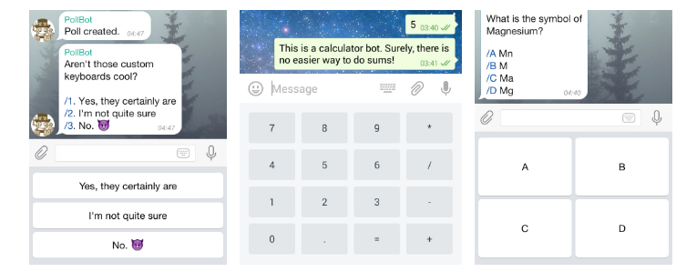
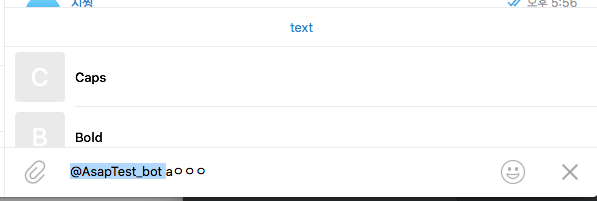
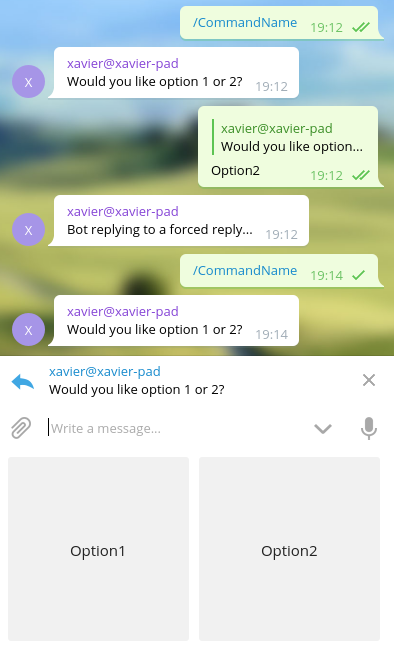

### Telegram Bot

1. How to interact

- Commands : messages start with a slash are always passed to the bot
Telegram
- suggest when user type /
- show slash in input field
= highlight /commands

- inLine

Like User can command or make bot do something, Bot can urge input from user.

- custom Keyboards: [ReplyKeyboardMarkup]("https://core.telegram.org/bots/api/#replykeyboardmarkup")
custom keyboards are a way to suggest specific reactions to user. If user click a button, chat is sent.

- inline keyboards[]
Unlike replykeyBoardMarkup, user can react to bot without sending messages.
when user press a inline button, callback button for example, bot receives the relevant query but messages does not sent.
bot can display result in a notification or alert.

switch to pm  : https://core.telegram.org/bots/api#answerinlinequery

- force reply :  force to user to reply to bot.
[force Reply]("https://core.telegram.org/bots/api#forcereply")
